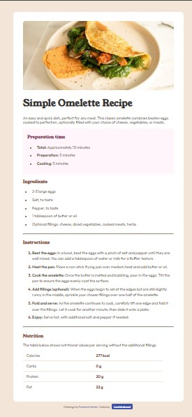

# Frontend Mentor - Recipe page solution

This is a solution to the [Recipe page challenge on Frontend Mentor](https://www.frontendmentor.io/challenges/recipe-page-KiTsR8QQKm). Frontend Mentor challenges help you improve your coding skills by building realistic projects. 

## Table of contents

- [Overview](#overview)
  - [Screenshot](#screenshot)
  - [Links](#links)
  - [Built with](#built-with)
  - [What I learned](#what-i-learned)
  - [Continued development](#continued-development)
  - [Useful resources](#useful-resources)
- [Author](#author)
- [Acknowledgments](#acknowledgments)


## Overview
This is a solution to the Recipe Page challenge on Frontend Mentor. The goal of this challenge was to build a simple and responsive recipe page using only HTML and CSS, following the given style guide.  


### Screenshot




### Links

- Solution URL: (https://github.com/lamideakani/recipe-page)
- Live Site URL: (https://lamideakani.github.io/recipe-page/)


### Built with

- Semantic HTML5 markup
- CSS3 (custom properties, selectors, pseudo-classes)
- A little Flexbox (for centering)
- Mobile-first workflow
- Responsive design


### What I learned

During this challenge, I ran into a few things that weren’t so obvious at first, but I figured them out while working through the project:

- **Adding borders between table rows except the last one** using `:not(:last-child)`  
  This was useful to create separation lines without double borders at the bottom.

    ```css
    .landing-page-table tbody tr:not(:last-child){
      border-bottom: hsl(30, 54%, 90%) 1px solid;
    }
    ```

- **Targeting only the second column in a table with nth-child**
  I used this to style just the values column differently from the labels.
  
    ```css
    .landing-page-table tr td:nth-child(2){
    color: hsl(14, 45%, 36%);
    font-weight: 900;
    }
    ```
- **Centering an image inside a container**
  At first, margin and align-self didn’t work, but using flexbox solved it:

    ```css
    .container{
    background-color:  hsl(0, 0%, 100%);
    margin: auto;
    width: 50%;
    padding: 40px;
    border-radius: 15px;
    max-width: 650px;
    }
    ```
- **Creating an email link with mailto: instead of a regular link.**
   ```html 
    <a href="mailto:olamideenoch167@gmail.com?subject=Frontend Mentor Project Feedback" class="email-btn">
  Lamideakanni
    </a>.
    ```
These were little stumbling blocks, but I’m glad I got through them — each one made the final design cleaner.

### Continued development

Going forward, I want to focus more on:  
- Improving my **CSS layouts** (especially Grid and responsive design).  
- Getting more comfortable with **pseudo-classes and selectors** like `:not()`, `nth-child()`, etc.  
- Practicing **cleaner, reusable CSS** instead of repeating styles.  
- Becoming more confident with **accessibility features** (semantic HTML, alt text, contrast).  


### Useful resources

- [Brad Traversy on YouTube](https://www.youtube.com/c/TraversyMedia) - His tutorials always make HTML and CSS concepts easier to understand, and I found them really helpful while practicing.  
- [ChatGPT (OpenAI)](https://chat.openai.com/) - Helped me understand and fix specific issues like centering content, targeting elements with `nth-child`, and styling list markers separately.  


## Author

- Frontend Mentor - [@lamideakani](https://www.frontendmentor.io/profile/lamideakani)  
- Twitter - [@lamideakanni](https://twitter.com/lamideakanni)  
- Email - [olamideenoch167@gmail.com](mailto:olamideenoch167@gmail.com)  


## Acknowledgments

Thanks to Frontend Mentor for this challenge!
